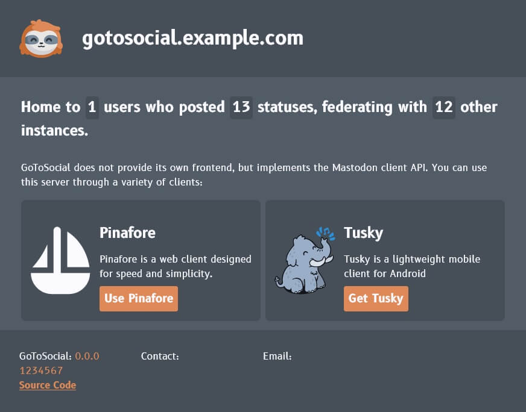

<!--
N.B.: This README was automatically generated by https://github.com/YunoHost/apps/tree/master/tools/README-generator
It shall NOT be edited by hand.
-->

# GoToSocial for YunoHost

[](https://dash.yunohost.org/appci/app/gotosocial)  

[](https://install-app.yunohost.org/?app=gotosocial)

*[Lire ce readme en français.](./README_fr.md)*

> *This package allows you to install GoToSocial quickly and simply on a YunoHost server.
If you don't have YunoHost, please consult [the guide](https://yunohost.org/#/install) to learn how to install it.*

## Overview

GoToSocial is an [ActivityPub](https://activitypub.rocks/) social network server, written in Golang.

With GoToSocial, you can keep in touch with your friends, post, read, and share images and articles. All without being tracked or advertised to!


Documentation is at [docs.gotosocial.org](https://docs.gotosocial.org).


**Shipped version:** 0.9.0~ynh2

## Screenshots



## Disclaimers / important information

GoToSocial is still in alpha and **may be unstable**. You can read [the roadmap](https://github.com/superseriousbusiness/gotosocial/blob/main/ROADMAP.md) to check the progress of GoToSocial's features.

GoToSocial require a **dedicated root domain**, for example: gotosocial.domain.tld.

This package is not-working SSO (single-sign on) or LDAP integration.  
You will have a separate account from the rest of your Yunohost server, potentially with a different username and password.

GoToSocial **does not provide a user interface**.  
You will need to use a Mastodon-compatible client such as [Tusky](https://tusky.app/) on Android or an instance of [Pinafore](https://pinafore.social/) on the Web.

### Things to know

#### Administration

You can login with your admin user (the one automatically created at the instalaltion) to your-instance.com/**admin** or using the public instance [gts.superseriousbusiness.org/admin](https://gts.superseriousbusiness.org/admin/) to administrate your GoToSocial instance.  
[The source code of this administration panel](https://github.com/superseriousbusiness/gotosocial-admin) is available on github.  
[The GTS admin panel documentation](https://docs.gotosocial.org/en/latest/admin/admin_panel/).

In this administration interface, you can configure the following things:

* The name of your instance
* Its description
* Your contact e-mail address
* The referring user
* Blocked domains (not to federate with)

#### Configuration

You can configure your instance using the config panel integrated in Yunohost, you will find it in the admin interface of your Yunohost by following these steps:  
`Applications > gotosocial > Configure this app (Config Panel)`

In this control panel you can configure the following things:

* Account configuration :
  * Are registrations open?
  * Manual validation of registrations?
  * Required reason for registration?
* Media configuration
  * Maximum image size
  * Maximum video size
  * Minimum number of characters for media descriptions
  * Maximum number of characters for media descriptions
  * Number of days media can be cached
* Post configuration
  * Maximum number of characters for a new post
  * Maximum number of characters in a Content Warning / subject of a new post
  * Maximum number of options for a poll
  * Maximum number of characters for a poll option
  * Maximum number of media that can be added to a post

Note: **Do not edit** the `config.yaml` file by hand. Always use this config panel instead. Otherwise your changes will be deleted at each update!

#### Command line (CLI)

To use the GoToSocial command line, you first need to place yourself in the folder of your instance:  
`cd /var/www/gotosocial/` or `cd /var/www/gotosocial__x/` (where `x` is the installation number of your instance, in the case of multi-installation)  
Feel free to refer to the [GoToSocial command line documentation](https://docs.gotosocial.org/en/latest/admin/cli/).

#### User creation

To create a new user, proceed as follows:

``` bash
./gotosocial --config-path config.yaml admin account create --username some_username --email someuser@example.org --password 'SomeLongAndComplicatedPassword'
```

And to promote them as an administrator of your instance:

``` bash
./gotosocial --config-path config.yaml admin account promote --username some_username
```

## :red_circle: Antifeatures

- **Alpha software**: Early development stage. May contain changing or unstable features, bugs, and security vulnerability.

## Documentation and resources

* Official app website: <https://gotosocial.org/>
* Official user documentation: <https://docs.gotosocial.org/en/latest/>
* Official admin documentation: <https://docs.gotosocial.org/en/latest/>
* Upstream app code repository: <https://github.com/superseriousbusiness/gotosocial>
* YunoHost documentation for this app: <https://yunohost.org/app_gotosocial>
* Report a bug: <https://github.com/YunoHost-Apps/gotosocial_ynh/issues>

## Developer info

Please send your pull request to the [testing branch](https://github.com/YunoHost-Apps/gotosocial_ynh/tree/testing).

To try the testing branch, please proceed like that.

``` bash
sudo yunohost app install https://github.com/YunoHost-Apps/gotosocial_ynh/tree/testing --debug
or
sudo yunohost app upgrade gotosocial -u https://github.com/YunoHost-Apps/gotosocial_ynh/tree/testing --debug
```

**More info regarding app packaging:** <https://yunohost.org/packaging_apps>
