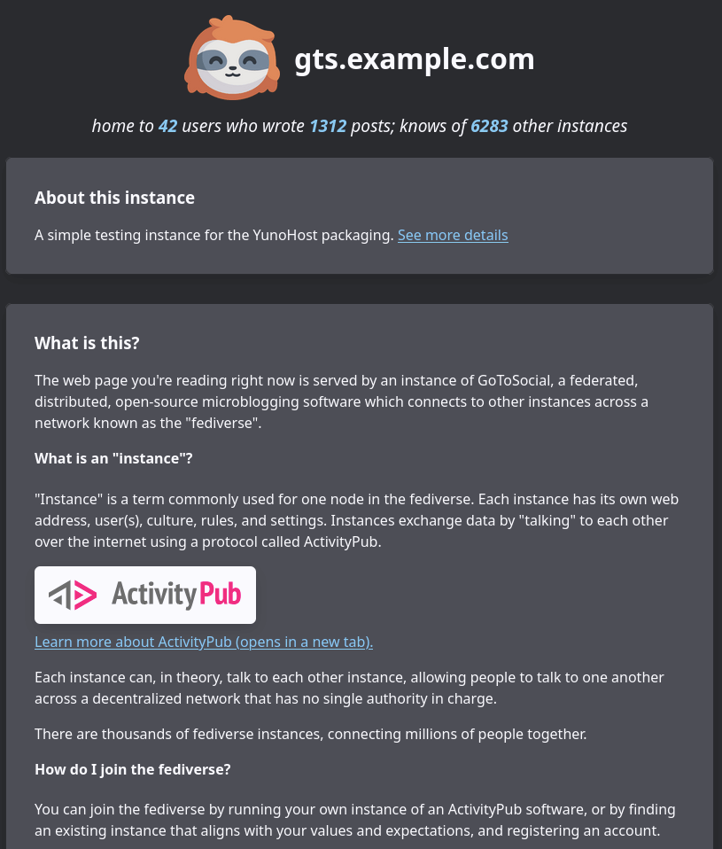

<!--
N.B.: Diese README wurde automatisch von <https://github.com/YunoHost/apps/tree/master/tools/readme_generator> generiert.
Sie darf NICHT von Hand bearbeitet werden.
-->

# GoToSocial für YunoHost

[](https://ci-apps.yunohost.org/ci/apps/gotosocial/)


[](https://install-app.yunohost.org/?app=gotosocial)

*[Dieses README in anderen Sprachen lesen.](./ALL_README.md)*

> *Mit diesem Paket können Sie GoToSocial schnell und einfach auf einem YunoHost-Server installieren.*  
> *Wenn Sie YunoHost nicht haben, lesen Sie bitte [die Anleitung](https://yunohost.org/install), um zu erfahren, wie Sie es installieren.*

## Übersicht

GoToSocial is a fast [ActivityPub](https://activitypub.rocks/) social network server, written in Golang.

With GoToSocial, you can keep in touch with your friends, post, read, and share images and articles. All without being tracked or advertised to!

The official documentation is at [docs.gotosocial.org](https://docs.gotosocial.org).  

Admins are **strongly encouraged to read the documentation** of this package after installing it. It is available in the webadmin under Applications > gotosocial (at the bottom) or [here on the package's repository](https://github.com/YunoHost-Apps/gotosocial_ynh/blob/master/doc/ADMIN.md)!

Please note that this package uses the ["i'm so tired" software license 1.0](https://github.com/YunoHost-Apps/gotosocial_ynh/blob/master/LICENSE), please read it and accept it before proceeding with installation.


**Ausgelieferte Version:** 0.18.3~ynh1

## Bildschirmfotos



## :red_circle: Anti-Eigenschaften

- **Alpha software**: Early development stage. May contain changing or unstable features, bugs, and security vulnerability.
- **Not totally free package**: The YunoHost package of this app is under an overall free license, but with clauses that may restrict its use.

## Dokumentation und Ressourcen

- Offizielle Website der App: <https://gotosocial.org/>
- Offizielle Benutzerdokumentation: <https://docs.gotosocial.org/en/latest/>
- Offizielle Verwaltungsdokumentation: <https://docs.gotosocial.org/en/latest/>
- Upstream App Repository: <https://github.com/superseriousbusiness/gotosocial>
- YunoHost-Shop: <https://apps.yunohost.org/app/gotosocial>
- Einen Fehler melden: <https://github.com/YunoHost-Apps/gotosocial_ynh/issues>

## Entwicklerinformationen

Bitte senden Sie Ihren Pull-Request an den [`testing` branch](https://github.com/YunoHost-Apps/gotosocial_ynh/tree/testing).

Um den `testing` Branch auszuprobieren, gehen Sie bitte wie folgt vor:

```bash
sudo yunohost app install https://github.com/YunoHost-Apps/gotosocial_ynh/tree/testing --debug
oder
sudo yunohost app upgrade gotosocial -u https://github.com/YunoHost-Apps/gotosocial_ynh/tree/testing --debug
```

**Weitere Informationen zur App-Paketierung:** <https://yunohost.org/packaging_apps>
