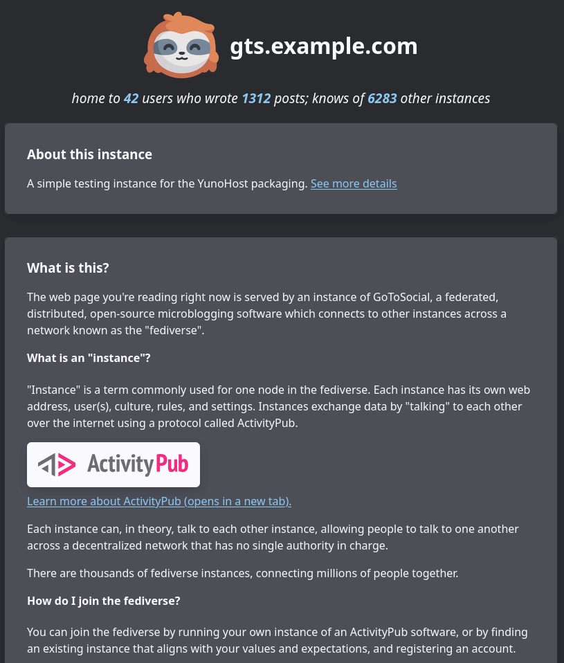

<!--
NOTA: Este README foi creado automáticamente por <https://github.com/YunoHost/apps/tree/master/tools/readme_generator>
NON debe editarse manualmente.
-->

# GoToSocial para YunoHost

[](https://ci-apps.yunohost.org/ci/apps/gotosocial/)  

[](https://install-app.yunohost.org/?app=gotosocial)

*[Le este README en outros idiomas.](./ALL_README.md)*

> *Este paquete permíteche instalar GoToSocial de xeito rápido e doado nun servidor YunoHost.*  
> *Se non usas YunoHost, le a [documentación](https://yunohost.org/install) para saber como instalalo.*

## Vista xeral

GoToSocial is a fast [ActivityPub](https://activitypub.rocks/) social network server, written in Golang.

With GoToSocial, you can keep in touch with your friends, post, read, and share images and articles. All without being tracked or advertised to!

The official documentation is at [docs.gotosocial.org](https://docs.gotosocial.org).  

Admins are **strongly encouraged to read the documentation** of this package after installing it. It is available in the webadmin under Applications > gotosocial (at the bottom) or [here on the package's repository](https://github.com/YunoHost-Apps/gotosocial_ynh/blob/master/doc/ADMIN.md)!

Please note that this package uses the ["i'm so tired" software license 1.0](https://github.com/YunoHost-Apps/gotosocial_ynh/blob/master/LICENSE), please read it and accept it before proceeding with installation.


**Versión proporcionada:** 0.17.3~ynh1

## Capturas de pantalla



## :red_circle: Debes considerar

- **Alpha software**: Early development stage. May contain changing or unstable features, bugs, and security vulnerability.
- **Not totally free package**: The YunoHost package of this app is under an overall free license, but with clauses that may restrict its use.

## Documentación e recursos

- Web oficial da app: <https://gotosocial.org/>
- Documentación oficial para usuarias: <https://docs.gotosocial.org/en/latest/>
- Documentación oficial para admin: <https://docs.gotosocial.org/en/latest/>
- Repositorio de orixe do código: <https://github.com/superseriousbusiness/gotosocial>
- Tenda YunoHost: <https://apps.yunohost.org/app/gotosocial>
- Informar dun problema: <https://github.com/YunoHost-Apps/gotosocial_ynh/issues>

## Info de desenvolvemento

Envía a túa colaboración á [rama `testing`](https://github.com/YunoHost-Apps/gotosocial_ynh/tree/testing).

Para probar a rama `testing`, procede deste xeito:

```bash
sudo yunohost app install https://github.com/YunoHost-Apps/gotosocial_ynh/tree/testing --debug
ou
sudo yunohost app upgrade gotosocial -u https://github.com/YunoHost-Apps/gotosocial_ynh/tree/testing --debug
```

**Máis info sobre o empaquetado da app:** <https://yunohost.org/packaging_apps>
